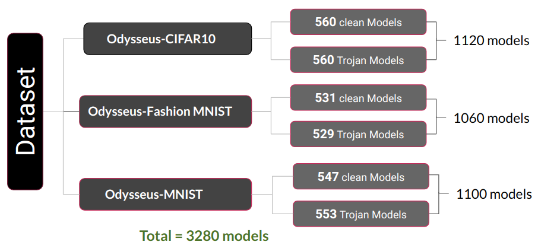

# Odyssey: Creation, Analysis and Detection of Trojan Models

## Summery
Trojan attack is one of the recent variant of data poisoning attacks that involves manipulation or modification of the model to act balefully.
This can occur when an attacker interferes with the training pipeline by inserting triggers into some of the training samples and trains the model to act maliciously only for samples that are stamped with trigger. Since the knowledge of such triggers is only privy to the attacker, detection of Trojan behaviour is a challenge task. 

A major reason for the lack of a realistic Trojan detection method has been the unavailability of a large-scale benchmark dataset, consisting of clean and Trojan models. Here we introduce [**Odysseus**](https://drive.google.com/drive/folders/1o-F3ttZS6el975XZOHOtqj8YxncHOivd?usp=sharing) the largest public dataset that contains over 3,000 clean and Tojan models. These models are trained on 3 CIFAR10, Fashion-MNIST and MNIST datasets. 

While creating this dataset, we focused on several factors such as mapping type, model architectures, fooling rate and validation accuracy of each model, type of trigger. 

