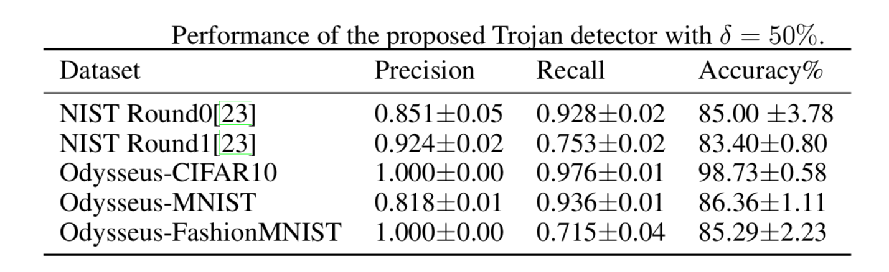

# Odyssey: Creation, Analysis and Detection of Trojan Models 

 Marzieh Edraki1, Nazmul Karim  2  
Nazanin Rahnavard1,2, Ajmal Mian 3 and Mubarak Shah1 
1 Center for Research in Computer Vision 
2Department of Electrical and Computer Engineering  
The University of Central Florida  
3 School of Computer Science and Software Engineering  
The University of Western Australia  

   

Odyssey is a comprehensive study on creating, analaysing and detecting Trojan models conducted jointly by [**CRCV group**](https://www.crcv.ucf.edu), [**MIG group**](https://staffhome.ecm.uwa.edu.au/~00053650/) and [**LCWN lab**](http://cwnlab.eecs.ucf.edu).  

## Introduction 
Trojan attack is one of the recent variant of data poisoning attacks that involves manipulation or modification of the model to act balefully.
This can occur when an attacker interferes with the training pipeline by inserting triggers into some of the training samples and trains the model to act maliciously only for samples that are stamped with trigger. Since the knowledge of such triggers is only privy to the attacker, detection of Trojan behaviour is a challenge task. 

A major reason for the lack of a realistic Trojan detection method has been the unavailability of a large-scale benchmark dataset, consisting of clean and Trojan models. Here we introduce [**Odysseus**](https://drive.google.com/drive/folders/1o-F3ttZS6el975XZOHOtqj8YxncHOivd?usp=sharing) the largest public dataset that contains over 3,000 trained clean and Tojan models based on Pytorch. 

## Odysseus

While creating [**Odysseus**](https://drive.google.com/drive/folders/1o-F3ttZS6el975XZOHOtqj8YxncHOivd?usp=sharing), we focused on several factors such as mapping type, model architectures, fooling rate and validation accuracy of each model and also type of trigger. These models are trained on CIFAR10, Fashion-MNIST and MNIST datasets. 
 
 

## Trojan Detector
By analysising the models in Odysseus, we found that Trojan attacks affect the intrinisic properties of NN models. Specifically they can  
  * Reduce the classifier margin.
  * Reduce the non-linearity of the decission boundaries around clean data.
  
  Based on these findings, we propose a new Trojan detector that sets a high baseline for the Odysseus dataset. 

  

## Accessing Odysseus
You can download the whole dataset or part of it based on your need.
  * [Odysseus-CIFAR10 ](https://drive.google.com/file/d/1xOP02xMflwpn0M7WGa9PibvxAdnNA4tn/view?usp=sharing)
  * [Odysseus-FashionMNIST](https://drive.google.com/file/d/1vuHQUPU7tOYPOPuZwWUOdDTjyFNM7lo4/view?usp=sharing)
  * [Odysseus-MNIST](https://drive.google.com/file/d/1RN70TqTJQ5eop-Dspiqcbt3AjF1GTvQR/view?usp=sharing)
  
  
